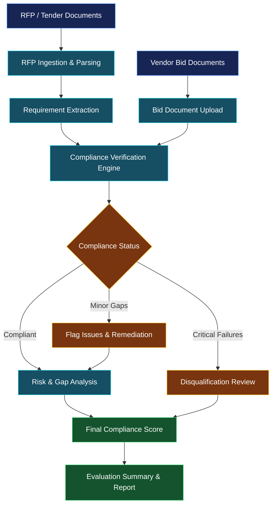

# Bid-Compliance-System

## System Workflow

```mermaid
flowchart TD
    A["RFP / Tender Documents"] --> B["RFP Ingestion & Parsing"]
    B --> C["Requirement Extraction"]
    D["Vendor Bid Documents"] --> E["Bid Document Upload"]
    C --> F["Compliance Verification Engine"]
    E --> F
    F --> G{"Compliance Status"}
    G -->|Compliant| H["Risk & Gap Analysis"]
    G -->|Minor Gaps| I["Flag Issues & Remediation"]
    G -->|Critical Failures| J["Disqualification Review"]
    I --> H
    H --> K["Final Compliance Score"]
    J --> K
    K --> L["Evaluation Summary & Report"]

    classDef input fill:#172554,stroke:#60a5fa,color:#fff
    classDef engine fill:#164e63,stroke:#22d3ee,color:#fff
    classDef decision fill:#78350f,stroke:#fbbf24,color:#fff
    classDef output fill:#14532d,stroke:#4ade80,color:#fff

    class A,D input
    class B,C,E,F,H engine
    class G,I,J decision
    class K,L output
```
